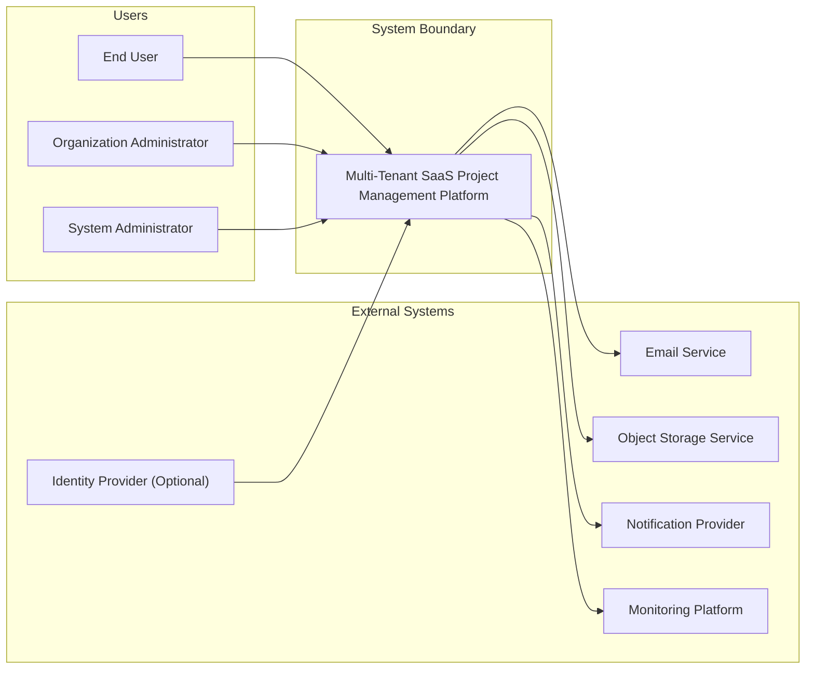

# Context Diagram

## 1. Purpose

This document defines the **System Context** of the **Multi-Tenant SaaS Project Management Platform** following the **C4 Model – Level 1 (System Context Diagram)**.

Its purpose is to identify the system under design, its primary users, external systems, and the high-level relationships between them. The document provides a shared understanding of the system boundary without describing its internal architecture.

---

# 2. Overview

The Multi-Tenant SaaS Project Management Platform is a cloud-based collaboration system that enables multiple organizations (tenants) to manage projects, teams, tasks, and related activities within a shared platform while maintaining complete logical isolation of organizational data.

At the context level, the platform is viewed as a single software system interacting with users and supporting external services. Internal architectural decisions, modules, databases, and implementation details are intentionally excluded.

---

# 3. Scope

This document covers:

- The system under design
- Primary user roles
- External systems interacting with the platform
- High-level relationships
- Trust boundaries

This document does **not** include:

- Container architecture
- Component architecture
- Module design
- Database design
- API specifications
- Deployment architecture
- Runtime behavior
- Implementation details

---

# 4. System Under Design

**System Name**

**Multi-Tenant SaaS Project Management Platform**

**Primary Responsibility**

Provide a centralized platform that enables organizations to:

- Manage organizational structures
- Organize collaborative workspaces
- Plan and execute projects
- Manage sprints and tasks
- Collaborate through comments and attachments
- Receive notifications
- Maintain audit history
- Search business information

The platform serves multiple independent organizations while ensuring strict logical isolation between tenants.

---

# 5. Primary Actors

## End User

Represents individual members who perform daily project management and collaboration activities.

Typical responsibilities include:

- Managing assigned work
- Collaborating with team members
- Updating project information
- Tracking progress

---

## Organization Administrator

Represents users responsible for managing an organization's operational environment.

Typical responsibilities include:

- Managing organization settings
- Managing workspaces
- Managing members
- Assigning organizational roles
- Monitoring organizational activities

---

## System Administrator

Represents platform operators responsible for managing the overall SaaS environment.

Typical responsibilities include:

- Platform administration
- Operational governance
- Tenant oversight
- Platform monitoring
- Maintenance activities

---

# 6. External Systems

## Email Service

Provides outbound email delivery for platform-generated communications such as invitations, notifications, and account-related messages.

---

## Object Storage Service

Provides durable storage for uploaded business files and attachments.

---

## Notification Provider

Delivers notifications through supported communication channels.

---

## Monitoring Platform

Collects operational telemetry and supports health monitoring, diagnostics, and operational visibility.

---

## Identity Provider (Optional)

Provides external identity authentication when organizational authentication integration is enabled.

This integration is optional and does not represent a mandatory deployment dependency.

---

# 7. Relationships

| Source | Target | Relationship |
|----------|---------|-------------|
| End User | Platform | Uses project management and collaboration capabilities |
| Organization Administrator | Platform | Manages organization resources and members |
| System Administrator | Platform | Administers and operates the platform |
| Platform | Email Service | Sends business communications |
| Platform | Object Storage Service | Stores and retrieves business attachments |
| Platform | Notification Provider | Delivers user notifications |
| Platform | Monitoring Platform | Publishes operational telemetry |
| Identity Provider | Platform | Authenticates user identities when enabled |

---

# 8. Trust Boundaries

The following trust boundaries exist at the context level:

## Tenant Boundary

Each organization operates within its own logical tenant boundary.

The platform is responsible for ensuring that organizational data remains isolated from other tenants.

---

## Platform Boundary

The platform acts as the central trusted system responsible for coordinating business operations and interactions with external services.

---

## External Service Boundary

External services operate independently from the platform.

Interactions with these services are limited to well-defined business responsibilities without exposing internal system design.

---

# 9. Assumptions

The following assumptions apply to the system context:

- Organizations are independent tenants.
- Users belong to one or more organizations based on business authorization.
- External services are considered trusted infrastructure dependencies.
- External integrations may evolve over time without changing the overall system boundary.
- The platform remains the central system of record for project management activities.

---

# 10. Context Diagram (Mermaid)

---

# 11. Diagram Explanation

The context diagram presents the platform as a single software system within its system boundary.

Three categories of human actors interact directly with the platform:

- End Users
- Organization Administrators
- System Administrators

Several supporting external systems provide specialized capabilities that complement the platform, including:

- Email delivery
- File storage
- Notification delivery
- Operational monitoring
- Optional identity authentication

The diagram intentionally omits all internal architectural structures, implementation details, communication protocols, and deployment topology, in accordance with the C4 Model Level 1 guidelines.

---

# 12. Design Considerations

The context model reflects several important design principles.

### Clear System Boundary

The platform owns all business capabilities while external systems provide supporting infrastructure services.

### Tenant Isolation

Multiple organizations share the same platform while maintaining strict logical separation of organizational data.

### Separation of Responsibilities

Business users, organizational administrators, and platform administrators each interact with the system according to distinct operational responsibilities.

### Extensible Integration Model

External integrations are represented as independent systems, allowing additional services to be introduced without changing the overall system context.

### Technology Independence

The context model focuses exclusively on business relationships and intentionally avoids implementation-specific details.

---

# 13. Related Documents

## Product Documentation

- Business-Problem.md
- Vision.md
- Goals.md
- Scope.md

## Architecture Decision Records

- ADR-0001 — Project Selection
- ADR-0002 — Architecture Style
- ADR-0003 — Technology Selection

## Architecture Documentation

- Executive-Summary.md
- Functional-Requirements.md
- Non-Functional-Requirements.md
- Container-Diagram.md *(planned)*
- Component-Diagram.md *(planned)*
- Deployment-View.md *(planned)*

---

# 14. Conclusion

This document defines the **System Context (C4 Model Level 1)** for the Multi-Tenant SaaS Project Management Platform. It identifies the platform's position within its operational environment by describing its primary users, supporting external systems, trust boundaries, and high-level relationships.

By deliberately excluding internal architectural details, this context view establishes a shared understanding of the system's scope and external interactions, providing the foundation for subsequent architecture documentation such as the Container Diagram (C4 Level 2), Component Diagram (C4 Level 3), and deployment views.