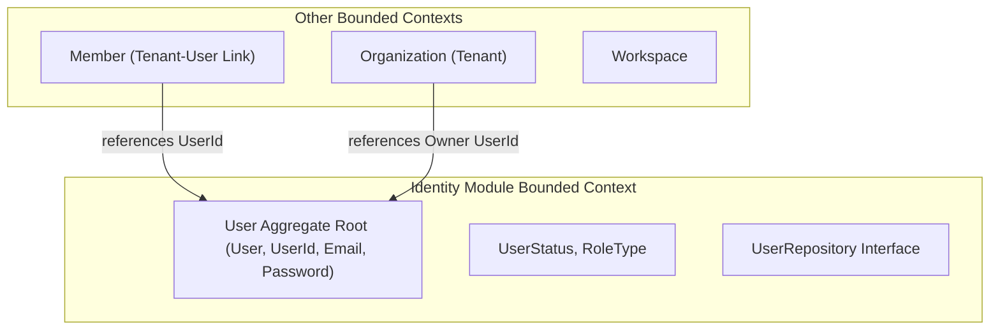
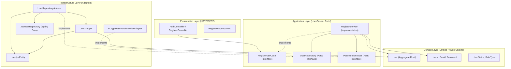
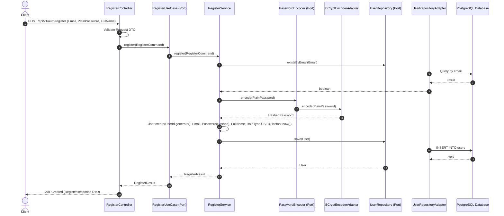

# Identity Module Architecture Design

## 1. Executive Summary

This document defines the formal architecture design for the **Identity Module** of the WorkForge platform. Previous analyses and code inspections identified that the project follows a **Modular Monolith** style using **Clean Architecture** and **Domain-Driven Design (DDD)**. 

To enable seamless subsequent coding tasks without architectural ambiguity, this design formalizes:
*   The strict business and conceptual boundaries of the Identity Module.
*   The detailed responsibilities of the Domain, Application, Infrastructure, and Presentation layers.
*   The structural mapping for the `User` aggregate root and its persistence schema.
*   The operational flows for User Registration (`AUTH-01`) and Persistence Mapping.
*   A clear roadmap to resolve current compilation/build errors and implement missing adapters.

---

## 2. Business Responsibility

### 2.1 In Scope
The Identity Module is strictly responsible for managing global account records and authentication context. Specifically:
*   **Account Lifecycle:** Managing states of account validation (`PENDING_VERIFICATION`, `ACTIVE`, `SUSPENDED`, `LOCKED`, `DELETED`).
*   **Security Credentials:** Preserving hashed credentials (`Password` Value Object) and orchestrating security state transitions (change password, password resets).
*   **System Authorization Roles:** Defining system-wide administrative roles (`SYSTEM_ADMIN`, `TENANT_ADMIN`, `USER`).
*   **Account Properties:** Ownership of core identifying attributes (Email, Full Name).

### 2.2 Out of Scope
The following concepts are explicitly managed by other modules to enforce clean boundaries:
*   **Tenant / Organization Management:** Creation of organizations or managing company structures (managed by `Organization`).
*   **Organization Membership:** Linking a user to a specific organization or assigning organization-specific administrative roles (managed by `Member`/`Organization`).
*   **Workspace / Project Membership:** Association of users to teams, workspaces, or projects (managed by `Workspace`/`Project`/`Member`).
*   **Third-party integration:** UI layout and design of login screens (Frontend responsibility).

### 2.3 Uncertain
*   **Email Verification Tokens:** The mechanics of generating, expiring, and persisting verification tokens (Redis vs PostgreSQL) are currently undecided and will be finalized at the Infrastructure layer.
*   **Failed Attempt Lockout Rules:** Policies for transient lockout due to brute-force attempts (infrastructure rate-limiting vs domain status change).

---

## 3. Module Boundary

### 3.1 Identity Owns
*   `User` Aggregate Root.
*   Validation rules for `Email`, `Password` (hashed representation), and `UserId`.
*   Global system role type mapping (`RoleType`).
*   Validation logic for login eligibility (`canLogin()`).

### 3.2 Identity Does Not Own
*   `Tenant` or `Organization` entity definitions (owned by `Organization` module).
*   Membership matrices mapping users to workspace/projects (owned by `Member` module).
*   Audit logging storage (owned by `Audit` module).
*   Notifications queue dispatching (owned by `Notification` module).

---

## 4. Layer Architecture

```
identity/
├── domain/            <-- Pure Business Rules, Entities & Value Objects (Zero external dependencies)
├── application/       <-- Orchestration, Ports, Command & Result DTOs (Framework agnostic)
├── infrastructure/    <-- Spring Data JPA, Spring Security, BCrypt, Database Adapters (Framework dependent)
└── presentation/      <-- Spring REST Controllers, HTTP Request/Response DTOs, HTTP Validations
```

### 4.1 Domain Layer
*   **Aggregate Root:** [User](file:///c:/Workspace/spring-boot/workforge/backend/src/main/java/io/github/tphung1724/workforge/identity/domain/aggregate/User.java)
*   **Value Objects:** [UserId](file:///c:/Workspace/spring-boot/workforge/backend/src/main/java/io/github/tphung1724/workforge/identity/domain/valueobject/UserId.java), [Email](file:///c:/Workspace/spring-boot/workforge/backend/src/main/java/io/github/tphung1724/workforge/identity/domain/valueobject/Email.java), [Password](file:///c:/Workspace/spring-boot/workforge/backend/src/main/java/io/github/tphung1724/workforge/identity/domain/valueobject/Password.java)
*   **Enums:** [UserStatus](file:///c:/Workspace/spring-boot/workforge/backend/src/main/java/io/github/tphung1724/workforge/identity/domain/enums/UserStatus.java), [RoleType](file:///c:/Workspace/spring-boot/workforge/backend/src/main/java/io/github/tphung1724/workforge/identity/domain/enums/RoleType.java)
*   **Exceptions:** [DomainException](file:///c:/Workspace/spring-boot/workforge/backend/src/main/java/io/github/tphung1724/workforge/identity/domain/exception/DomainException.java), [IdentityErrorCode](file:///c:/Workspace/spring-boot/workforge/backend/src/main/java/io/github/tphung1724/workforge/identity/domain/exception/IdentityErrorCode.java) and sub-exceptions.
*   **Repository Port:** [UserRepository](file:///c:/Workspace/spring-boot/workforge/backend/src/main/java/io/github/tphung1724/workforge/identity/domain/repository/UserRepository.java) interface.

### 4.2 Application Layer
*   **Inbound Ports:** Use Case interfaces (e.g., [RegisterUseCase](file:///c:/Workspace/spring-boot/workforge/backend/src/main/java/io/github/tphung1724/workforge/identity/application/port/in/RegisterUseCase.java)).
*   **Outbound Ports:** Gateway interfaces representing dependencies on infrastructure (e.g., [PasswordEncoder](file:///c:/Workspace/spring-boot/workforge/backend/src/main/java/io/github/tphung1724/workforge/identity/application/port/out/PasswordEncoder.java)).
*   **DTOs:** Commands (e.g., [RegisterCommand](file:///c:/Workspace/spring-boot/workforge/backend/src/main/java/io/github/tphung1724/workforge/identity/application/command/RegisterCommand.java)) and Results (e.g., [RegisterResult](file:///c:/Workspace/spring-boot/workforge/backend/src/main/java/io/github/tphung1724/workforge/identity/application/result/RegisterResult.java)).
*   **Services:** Concrete orchestrators (e.g., [RegisterService](file:///c:/Workspace/spring-boot/workforge/backend/src/main/java/io/github/tphung1724/workforge/identity/application/service/RegisterService.java)) that load aggregates, execute domain logic, and save modifications within a transaction boundary.

### 4.3 Infrastructure Layer
*   **JPA Persistence Model:** `UserJpaEntity` (annotations for database column mapping).
*   **JPA Repository:** Spring Data JPA interface extending `JpaRepository<UserJpaEntity, UUID>`.
*   **Repository Adapter:** Implements [UserRepository](file:///c:/Workspace/spring-boot/workforge/backend/src/main/java/io/github/tphung1724/workforge/identity/domain/repository/UserRepository.java), wrapping Spring Data JPA and calling `UserMapper`.
*   **Mapper:** `UserMapper` converting between pure Domain aggregates (`User`) and database-bound models (`UserJpaEntity`).
*   **Security Adapters:** Implementations of outbound ports (e.g., `BCryptPasswordEncoderAdapter` implementing `PasswordEncoder`).
*   **Spring Security Configurations:** Filters, authentication configurations, and JWT handlers.

### 4.4 Presentation Layer
*   **Controllers:** REST controllers containing API mapping endpoints (e.g., `/api/v1/auth/register`).
*   **Request/Response DTOs:** HTTP payload structures containing Validation annotations (e.g., `@NotBlank`, `@Email`).
*   **Exception Mapping:** Integration with global handler mapping custom exception types to JSON payloads.

---

## 5. User Aggregate Architecture

`User` is the Bounded Context's Aggregate Root. It encapsulates identity, credentials, lifecycle status, and timestamps.

```
       +---------------------------------------------+
       |                User (Aggregate)             |
       +---------------------------------------------+
       | - id: UserId [VO]                           |
       | - email: Email [VO]                         |
       | - password: Password [VO]                   |
       | - fullName: String                          |
       | - status: UserStatus [Enum]                 |
       | - role: RoleType [Enum]                     |
       | - emailVerified: boolean                    |
       | - emailVerifiedAt: Instant                  |
       | - lastLoginAt: Instant                      |
       | - passwordChangedAt: Instant                |
       | - createdAt: Instant                        |
       | - updatedAt: Instant                        |
       +---------------------------------------------+
       | + create() [Static Factory]                 |
       | + reconstitute() [Static Factory]           |
       | + verifyEmail() / activate()                |
       | + suspend() / lock() / unlock()             |
       | + delete() / login()                        |
       | + changePassword() / resetPassword()        |
       +---------------------------------------------+
```

### 5.1 Factories Selection
*   **`User.create(...)`:** Used when generating a *brand new user* for the first time. Sets default lifecycle status to `PENDING_VERIFICATION`, `emailVerified` to `false`, and initializes timestamps.
*   **`User.reconstitute(...)`:** Used exclusively by the Infrastructure repository adapter when loading an existing record back from database storage. Restores all fields exactly as they exist in persistent storage without triggering registration-only side effects or business rule validations.

---

## 6. AUTH-01 Registration Architecture

The registration use case exposes a public endpoint to register a new user:
*   **Validation:** HTTP Request parameters are validated at the Presentation layer (e.g., validation on email format).
*   **Default Role Mapping:** Public registration **must not** trust a `RoleType` submitted in the payload. Public registration assigns a default role type (`RoleType.USER`). System admins are configured through private administration use cases.

```
Client         Controller          RegisterUseCase        RegisterService         UserRepository
  |                 |                     |                      |                      |
  |--- POST DTO --->|                     |                      |                      |
  |   (plain pass)  |                     |                      |                      |
  |                 |--- Command DTO ---->|                      |                      |
  |                 |                     |--- executeCommand -->|                      |
  |                 |                     |                      |--- existsByEmail --->|
  |                 |                     |                      |<-- boolean ----------|
  |                 |                     |                      |                      |
  |                 |                     |                      |-- PasswordEncoder.encode() -> [Hash]
  |                 |                     |                      |                      |
  |                 |                     |                      |--- User.create() --->|
  |                 |                     |                      |                      |
  |                 |                     |                      |--- save(User) ------>|
  |                 |                     |                      |<-- saved User -------|
  |                 |                     |<-- RegisterResult ---|                      |
  |                 |<-- RegisterResult --|                      |                      |
  |   201 Created   |                     |                      |                      |
  |<-- Response ----|                     |                      |                      |
```

---

## 7. Password Architecture

To preserve Domain purity, the domain layer does not handle hashing details:
*   **Plain Password:** Received only as plain text in DTOs within the Presentation and Application layers.
*   **Port Dependency:** `RegisterService` calls the `PasswordEncoder` outbound port.
*   **Encoding:** The infrastructure adapter `BCryptPasswordEncoderAdapter` uses BCrypt to hash the plain text.
*   **Encapsulation:** The domain `Password` value object is created *only* with the already-hashed value string.
*   **Domain Verification:** The aggregate root does not invoke raw encoder functions. Password verification for login is performed at the application layer by checking matching states via the port.

```
[Plain Password]
       │ (Spring Presentation / DTO)
       ▼
[Application Layer] ──> Calls outbound port ──> [PasswordEncoder Port]
                                                        │
                                                        ▼ (Infrastructure Adapter)
                                                [BCrypt Hashing Implementation]
                                                        │
                                                        ▼
[User Domain Aggregate] <── sets value object <── [Hashed Password]
```

---

## 8. Persistence Architecture

Persistence utilizes an adapter pattern to isolate the database framework:
*   **Domain Repository:** `UserRepository` defines simple query interfaces based on domain objects (`UserId`, `Email`).
*   **Spring Data Interface:** `JpaUserRepository` implements standard JPA query mechanisms operating on `UserJpaEntity`.
*   **Adapter Implementation:** `UserRepositoryAdapter` bridges the gap. It queries `JpaUserRepository`, processes `UserJpaEntity`, and calls `UserMapper` to reconstitute the `User` aggregate.
*   **No JPA annotations in Domain:** The domain aggregate remains pure. Only `UserJpaEntity` contains JPA mappings (`@Entity`, `@Table`, `@Column`).

```
  Domain Layer              Infrastructure Layer (Database Adapters)
+----------------+        +-----------------------+        +-------------------+
| UserRepository | <. . . | UserRepositoryAdapter | ----> | JpaUserRepository |
+----------------+        +-----------------------+        +-------------------+
                                  │               \          (Spring Data JPA)
                                  ▼                ▼
                            +------------+   +---------------+
                            | UserMapper |   | UserJpaEntity |
                            +------------+   +---------------+
```

---

## 9. Database Boundary

Logical mappings for the `users` table:

| Column | Type | Constraints | Description |
|---|---|---|---|
| `id` | `UUID` | PRIMARY KEY | Unique identifier for user records |
| `email` | `VARCHAR(254)` | UNIQUE, NOT NULL | Unique email address (indexed for rapid lookup) |
| `password_hash` | `VARCHAR(255)` | NOT NULL | Secure BCrypt hash of the password |
| `full_name` | `VARCHAR(200)` | NOT NULL | Full name of the user |
| `status` | `VARCHAR(50)` | NOT NULL | Account status representation (`UserStatus` Enum) |
| `role` | `VARCHAR(50)` | NOT NULL | System administrative role (`RoleType` Enum) |
| `email_verified` | `BOOLEAN` | NOT NULL DEFAULT FALSE | Verification flag |
| `email_verified_at`| `TIMESTAMP` | NULL | Exact timestamp of verification |
| `last_login_at` | `TIMESTAMP` | NULL | Last login event timestamp |
| `password_changed_at`| `TIMESTAMP`| NULL | Timestamp of last password change |
| `created_at` | `TIMESTAMP` | NOT NULL | Record creation date |
| `updated_at` | `TIMESTAMP` | NOT NULL | Record modification date |

> [!IMPORTANT]
> To prevent duplicate registrations under high concurrent requests, the email uniqueness constraint must be enforced at the database level (`email UNIQUE`). Relying solely on `existsByEmail()` checks in the application layer creates race conditions.

---

## 10. Transaction Boundary

Transaction boundaries are managed at the **Application Layer** using Spring's `@Transactional` annotation on use case implementations (e.g., `RegisterService`).
*   **Execution Scope:** The transactional context spans from checking email uniqueness to saving the fully created User aggregate.
*   **No domain dependencies:** Domain methods do not declare database transaction boundaries.

---

## 11. Exception Boundary

An exception hierarchy ensures clear separation of technical details and business responses:

```
Domain Layer Exceptions            Application / Common System Layer
 +-----------------+                     +---------------+
 | DomainException | ──────────────────> | BaseException |
 +-----------------+                     +---------------+
         │                                       │
         ▼                                       ▼
  (Identity Specific)                     +-------------------+      +-------------------------+
 InvalidEmailException, etc.             | BusinessException | ---> | GlobalExceptionHandler  |
                                          +-------------------+      +-------------------------+
                                                                                  │
                                                                                  ▼ (Produces)
                                                                       [HTTP JSON Response]
```

*   **Custom Handler:** `GlobalExceptionHandler` intercepts exceptions and translates them into uniform JSON responses (`ErrorResponse`).
*   **No HTTP status code leakage:** Domain exceptions only carry domain codes (`IdentityErrorCode`) and business messages. They have no references to HTTP codes (e.g., 400 Bad Request, 409 Conflict).

---

## 12. Security Boundary

*   **Domain:** Owns domain safety status checks (e.g., `canLogin()`).
*   **Application:** Coordinates authentication flows.
*   **Infrastructure (Security Adapter):** Owns Spring Security setups, filters, CORS controls, JWT issuance, JWT decryption, and JWT validation. No Spring Security dependencies are imported into the Application or Domain layers.

---

## 13. Cross-Module Boundaries

```
+-------------------+             +-----------------+
|    Member / Org   | ──Query───> | Identity Module |
+-------------------+             +-----------------+
                                           │
                                     Domain Event
                                           ▼
                                  +-----------------+
                                  |  Notification   |
                                  +-----------------+
```

*   **Access Direction:** The `Member` or `Organization` modules query the Identity module to fetch user profiles or validate email existences.
*   **Decoupling via Events:** Real-time communications between modules use **Domain Events** (e.g. `UserRegisteredEvent` dispatched from the aggregate root). In the future, this is bridged to **Integration Events** using a Message Broker (RabbitMQ) to trigger email deliveries in the `Notification` module.

---

## 14. Architectural Diagrams

### 14.1 Module Boundary & Context Map


### 14.2 Layer Architecture & Dependencies


### 14.3 AUTH-01 Register Sequence Flow


### 14.4 Persistence Flow
```mermaid
graph LR
    UserDomain["User (Domain Aggregate)"]
    Mapper["UserMapper"]
    JpaEntity["UserJpaEntity"]
    JpaRepo["JpaUserRepository (Spring Data)"]
    DB[("PostgreSQL (users table)")]

    UserDomain -->|Mapped to| Mapper
    Mapper -->|Produces| JpaEntity
    JpaEntity --> JpaRepo
    JpaRepo --> DB

    DB --> JpaRepo
    JpaRepo --> JpaEntity
    JpaEntity --> Mapper
    Mapper -->|Reconstitutes via User.reconstitute()| UserDomain
```

---

## 15. Architectural Decisions

*   **ADR-DEC-01:** `User` is established as the Aggregate Root for the Bounded Context.
*   **ADR-DEC-02:** `UserId` acts as a strongly typed ID wrapping a UUID.
*   **ADR-DEC-03:** `Email` and `Password` are represented as immutable Value Objects.
*   **ADR-DEC-04:** `Password` stores exclusively hashed strings; password encoding is handled via a boundary port interface.
*   **ADR-DEC-05:** `UserRepository` defines domain-layer contracts. All JPA implementations belong exclusively to the Infrastructure layer.
*   **ADR-DEC-06:** `UserJpaEntity` acts purely as a persistence model and remains isolated from the Domain layer.
*   **ADR-DEC-07:** `User.reconstitute()` maps state changes back from persistent storage without triggering registration business validations.
*   **ADR-DEC-08:** Public registration endpoints (`AUTH-01`) default to the `USER` role; they do not trust or consume `RoleType` from payload inputs.
*   **ADR-DEC-09:** Email uniqueness constraints are enforced directly at the database layer.
*   **ADR-DEC-10:** Domain layer remains fully framework-agnostic.
*   **ADR-DEC-11:** `GlobalExceptionHandler` methods are corrected to implement clean REST-compliant JSON structures (`ErrorResponse`).
*   **ADR-DEC-12 (UNDECIDED):** The exact database storage mechanism (shared table with `TenantID` vs separate database schemas) for Multi-Tenancy isolation is currently undecided and remains open.

---

## 16. Architectural Gaps

*   **GAP-01 (BLOCKING):** Compilation fails inside `GlobalExceptionHandler` due to empty methods returning `ResponseEntity<ErrorResponse>` without body contents or return statements.
*   **GAP-02 (BLOCKING):** Pom configurations map a non-existent parent Spring Boot version (`4.1.0`) and declare non-standard starters (`spring-boot-starter-webmvc`).
*   **GAP-03 (HIGH):** Database migrations (SQL schemas) are missing; no Flyway/Liquibase dependency is defined.
*   **GAP-04 (HIGH):** Spring Security dependencies are missing in POM; no authentication filters or token generators exist.
*   **GAP-05 (MEDIUM):** Plain text password complexity/strength validation is not yet implemented or mapped.
*   **GAP-06 (MEDIUM):** Refresh token storage and expiration mechanics are undecided.
*   **GAP-07 (LOW):** Email verification dispatching infrastructure is not defined.

---

## 17. Implementation Roadmap

```
01. Build Stabilization ────> 02. Dependency Mapping ────> 03. Infrastructure Persistence
          │                              │                              │
          ▼                              ▼                              ▼
(Fix GlobalException    (Add Spring Data JPA, Security   (Create UserJpaEntity,
  and Spring POM)           Postgres dependencies)       UserMapper, SQL Schemas)
                                                                        │
                                                                        ▼
06. System Verification <──── 05. Controller API <──── 04. Infrastructure Security
          │                              │                              │
          ▼                              ▼                              ▼
(Write JUnit tests for        (Add REST endpoints for      (Implement BCrypt encoder
 domain and controllers)       auth / register API)          adapter in infra layer)
```

### Phase 1: Build Stabilization
1.  Amend [pom.xml](file:///c:/Workspace/spring-boot/workforge/backend/pom.xml) to change parent Spring Boot version to a stable release (e.g., `3.3.2`).
2.  Change dependencies: `spring-boot-starter-webmvc` $\rightarrow$ `spring-boot-starter-web` and `spring-boot-starter-webmvc-test` $\rightarrow$ `spring-boot-starter-test`.
3.  Add return responses and body logic inside [GlobalExceptionHandler.java](file:///c:/Workspace/spring-boot/workforge/backend/src/main/java/io/github/tphung1724/workforge/common/exception/handler/GlobalExceptionHandler.java).

### Phase 2: Dependency Mapping
1.  Add `spring-boot-starter-data-jpa`, `postgresql` driver, and `spring-boot-starter-security` to [pom.xml](file:///c:/Workspace/spring-boot/workforge/backend/pom.xml).

### Phase 3: Infrastructure Persistence
1.  Create `UserJpaEntity` under `identity/infrastructure/persistence/entity/UserJpaEntity.java`.
2.  Create `UserMapper` under `identity/infrastructure/persistence/mapper/UserMapper.java`.
3.  Create `JpaUserRepository` extending `org.springframework.data.jpa.repository.JpaRepository`.
4.  Create `UserRepositoryAdapter` implementing [UserRepository](file:///c:/Workspace/spring-boot/workforge/backend/src/main/java/io/github/tphung1724/workforge/identity/domain/repository/UserRepository.java).
5.  Create database migration file (`src/main/resources/db/migration/V1__Create_Users_Table.sql`) mapping constraints described in Section 9.

### Phase 4: Infrastructure Security
1.  Create `BCryptPasswordEncoderAdapter` implementing [PasswordEncoder](file:///c:/Workspace/spring-boot/workforge/backend/src/main/java/io/github/tphung1724/workforge/identity/application/port/out/PasswordEncoder.java).
2.  Configure basic security filter chains inside Spring Security adapter class.

### Phase 5: Presentation Coding
1.  Create `RegisterRequest` DTO and `RegisterResponse` DTO inside `identity/presentation/dto`.
2.  Create `RegisterController` mapping `/api/v1/auth/register` to `RegisterUseCase`.

### Phase 6: System Verification
1.  Develop automated JUnit 5 tests inside `backend/src/test/` validating User aggregate behavior and presentation API responses.
